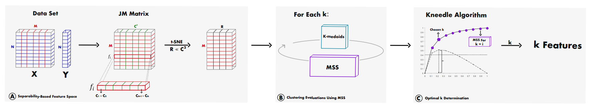

# GB-AFS: Graph-Based Automatic Feature Selection for Multi-Class Classification via Mean Simplified Silhouette
Official implementation of the Graph-Based Automatic Feature Selection (GB-AFS) model, a novel filter-based feature selection method for multi-class classification tasks. GB-AFS automatically determines the minimum combination of features required to sustain prediction performance while maintaining complementary discriminating abilities between different classes, without the need for user-defined parameters.



## Abstract
This paper introduces a novel graph-based filter method for automatic feature selection (abbreviated as GB-AFS) for multi-class classification tasks. The method determines the minimum combination of features required to sustain prediction performance while maintaining complementary discriminating abilities between different classes. It does not require any user-defined parameters such as the number of features to select. The methodology employs the Jeffries--Matusita (JM) distance in conjunction with t-distributed Stochastic Neighbor Embedding (t-SNE) to generate a low-dimensional space reflecting how effectively each feature can differentiate between each pair of classes. The minimum number of features is selected using our newly developed Mean Simplified Silhouette (abbreviated as MSS) index, designed to evaluate the clustering results for the feature selection task. Experimental results on public data sets demonstrate the superior performance of the proposed GB-AFS over other filter-based techniques and automatic feature selection approaches. Moreover, the proposed algorithm maintained the accuracy achieved when utilizing all features, while using only $7%$ to $30%$ of the features. Consequently, this resulted in a reduction of the time needed for classifications, from $15%$ to $70%$.

## Setup Environment
Install the repo:

```bash
git clone https://github.com/davidlevinwork/GB-AFS.git
cd GB-AFS
pip install -r requirements.txt
python3 main.py
```

## Support
If you find this repository useful, we would appreciate it if you could give it a STAR. Your support helps us to continue improving the model and its implementation.
